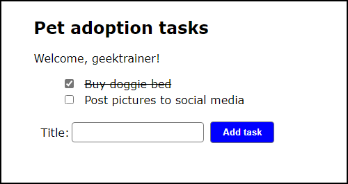
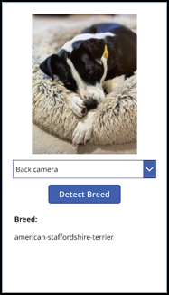
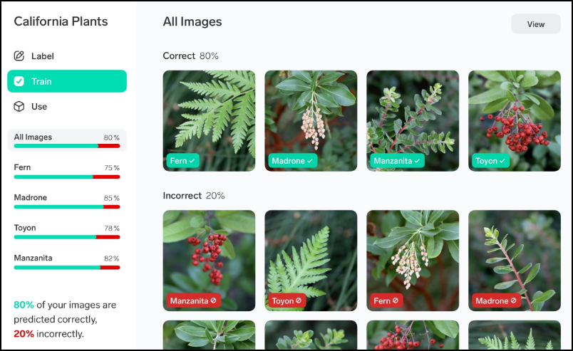

# Hack workshops

Want to learn more about the cloud tools from Microsoft? Don't want to just walk through a series of steps in a prescriptive lab? We've created a series of hack-based workshops to help educate and inspire you!

## The structure

Each hack-based workshop is built around a common hackathon scenario. You and your team will work together to achieve the goals put forth, learning by doing. After completing a workshop your team will have performed the actual activities you'll perform to bring your project onto the Microsoft Cloud, a set of assets you can continue to build upon, and ideas for using the scenario as a seed for your team's hack.

You will notice the structure is a bit different from normal workshops. In particular, there are no step-by-step instructions provided. Instead the workshop is broken down into a series of goals for your team to complete. Each goal has well defined criteria for success, and a series of links to all the necessary resources for achieving the goal. We find this self-exploration model works really well to help absorb the information. The goals are designed to be progressive, with each building on the one before it.

## The hacks

### The Pet Shelter - web app

[The Pet Shelter](https://github.com/microsoft/hack-workshop-web) is an organization to help rescue dogs find their forever homes. Your team has been asked to create them a website. To start they would like to provide a tool where a user could create a list of all the tasks they need to perform when they adopt a pet, like schedule their first vet appointment or apply for a dog license. Your team will do so by using [Azure Static Web Apps](https://docs.microsoft.com/azure/static-web-apps/overview?WT.mc_id=academic-0000-cxa) for hosting and an already created app template. Your team will also add [Azure Cosmos DB](https://docs.microsoft.com/azure/cosmos-db/introduction?WT.mc_id=academic-0000-cxa) to store the data.

### Mutt Matcher - IoT app

[The Mutt Matcher](https://github.com/microsoft/hack-workshop-iot) is an IoT device your team has been asked to build by an animal shelter to help identify different dog breeds. They have provided photos of a range of different dog breeds, and your task is to use these pictures to train an AI model that can be used from an IoT device, along with a dashboard to show the identified breed.

Your team will work to train an AI model using [Azure Custom Vision](https://customvision.ai), then use it from an IoT device that is managed using [Azure IoT Central](https://docs.microsoft.com/azure/iot-central?WT.mc_id=academic-0000-cxa).

> This workshop is designed to use a Raspberry Pi with a Raspberry Pi Camera Module, or a USB web cam. It can also be completed on your local computer using a built-in or external webcam if you don't have a Raspberry Pi.

### Mutt Matcher - low code mobile app

[The Mutt Matcher](https://github.com/microsoft/hack-workshop-power-apps) is a mobile app your team has been asked to build by an animal shelter to help identify different dog breeds. They have provided photos of a range of different dog breeds, and your task is to use these pictures to first train an AI model, then build a mobile app that uses this model to identify different breeds in photos taken using the mobile device.

Your team will work to train an AI model using [Azure Custom Vision](https://customvision.ai), then use it from a mobile app built using [Microsoft Power Apps](https://powerapps.microsoft.com?WT.mc_id=academic-0000-cxa), a low code developer tool.

### Lobe - free and easy ML model training

[Lobe](https://github.com/microsoft/hack-workshop-lobe) is a free and easy tool for Intel-based Macs and Windows PCs you can use to train image classifier ML models locally, then export them to use in any application. In this workshop you will learn how to use lobe to classify images captured either from your camera, or uploaded to the Lobe app. Once you model is trained, you will test it, export it, then deploy it to a web site.

> Lobe currently doesn't run on macOS devices that use Apple Silicon processors, such as the M1, M1 Pro and M1 Max.

